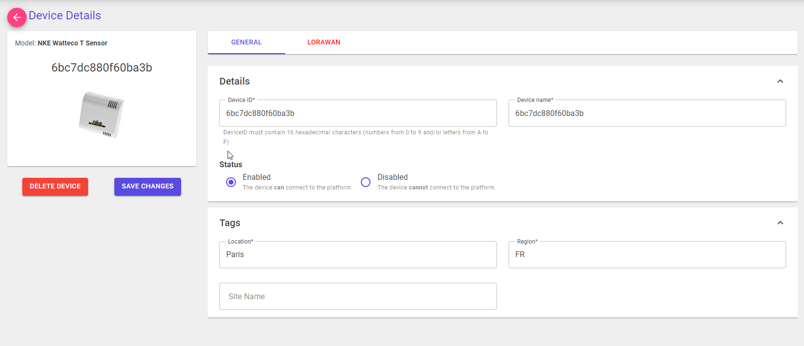

# Concepts

The Azure IoT Hub portal inherit from Azure IoT Hub concepts for mananing IoT devices.

Inside the Portal, the solution leverage the following concepts:

- IoT Device Provisioning
- IoT Hub Device Twin
- IoT Hub Device Twin Properties
- IoT Hub Edge deployment manifest

## Device models

By using this capability, the application can create logical representation of IoT devices. This feature is designed to configure a set of sharable properties between devices. 
When creating a device, the user is prompted to specify the device model. The application will then apply the properties of the device model to the device.

### Parameters

* ``Device Model Id``: The ID of the device model.
> Note: Since the device model is shared among all the devices, the ID should be unique. For convinience, the ID is generated by the application. By sing the API, the ID is not required, if provided, it will be used as the ID of the device model.
* ``Name``: The name of the device model.
* ``Description``: The description of the device model.

### Built-in models

Built-in models are predefined device models that can be used by the application. 
This functionnality is exactly the same as standard device models except that **the properties are not editable and the device model is not deletable** viat the Portal.

> Note: Create and update a Built-in models are not available in the portal. They can be managed on through the Azure IoT Hub portal APIs.
> 
> see [Device Model API reference]( ./open-api.html#tocS_DeviceModel) for more information.

## Devices

Devices are the physical IoT devices that are provisioned by the application. They are represented by an object that is stored in the Azure IoT Hub as the device twin.

### Parameters

* ``Device Id``: The ID of the device.
> Note: Device id the same as the device id stored in the Azure IoT Hub. It is prompte to the user when creating a device and is not editable after the device is created.
* ``Name``: The name of the device model.
> Note: The device name, is the device friendly name. The name is editable after the device is created.
* ``Device Model``: The device model that the device is based on.
> Note: The device model is prompted to the user during the device creation and is not editable after the device is created.
* ``Status``: The status of the device.
> Note: The status is related to the Device status in the Azure IoT Hub.

### Device Twin tags

To store additional information about the device, the application uses device twin tags.

| Name       	| Position        	| Description                                                                                                                                                  	|
|------------	|-----------------	|--------------------------------------------------------------------------------------------------------------------------------------------------------------	|
| deviceName 	| tags.deviceName 	| Field that contains the device friendly name. _**note**: if not set, the portal will show the device id instead of the device name until its configured._ 	|
| modelId    	| tags.modelId    	| Field that contains the device model identifier that the device is related. _**note**: if not set, the device is not usable on the IoT hub portal._       	|
| deviceType 	| tags.deviceType 	| Field that contains a human readable device type (ex: 'LoRa Device')                                                                                         	|

## IoT Edge

IoT Edge is fully herited from Azure IoT Hub concepts. By the portal, the user can mangage the IoT Edge devices from Azure IoT Hub.
For more information about Azure IoT Edge, see [Azure IoT Edge documentation](https://docs.microsoft.com/en-us/azure/iot-edge/).

### Parameters

* ``Type``: The type of the IoT Edge device.
> Note: related to the IoT Edge purpose tag vaiue that might be used to create deployment manifests.
* ``Environment``: The IoT Edge device environment (Development, Production, QA).
> Note: this is an additional field that can be used to create deployment manifests.
* ``Status``: The status of the device.
> Note: The status is related to the Device status in the Azure IoT Hub.
* ``Nbr of connected devices``: The number of devices connected to the IoT Edge device.
> Note: The number of connected devices is related to the number of connections that are currently present in the edgeHub module.
> This might be different from the number of devices connected to the IoT Edge device if some modules are using edgeHub connections.
* ``Nbr of desired modules``: The number of modules that are desired in the last deployment.

### Last deployment

The last deployment topic is related to the last deployment manifest of that is currently applied to the IoT Edge device.

### IoT Edge Module

The IoT Edge module section represents the modules that are currently deployed on the IoT Edge device. It doesn't include the system modules of IoT Edge (edgeAgent and edgeHub).
By the portail, the user can interact with those modules and manage them (Get last module logs, restart module, etc.).

### Device Twin tags

To store additional information about the device, the application uses device twin tags.

| Name    	| Position     	| Description                                                                                                                                 	|
|---------	|--------------	|---------------------------------------------------------------------------------------------------------------------------------------------	|
| purpose 	| tags.purpose 	| Field that contains the Device Type value. _**note**: this is the tag that might be used to target deployment manifest for the IoT Edge_ 	|

### DPS Enrollment groups

The IoT Hub portal leverage on Azure Device Provisioning Enrollement groups to manage IoT Edge device connection strings.
On click to "Connect" button in the IoT Edge details page, the user can access to the device unique credentials in the enrollment group.

> Note: see [Provision the device with its cloud identity
](https://docs.microsoft.com/en-us/azure/iot-edge/how-to-provision-devices-at-scale-linux-symmetric?view=iotedge-2020-11&tabs=individual-enrollment%2Cubuntu#provision-the-device-with-its-cloud-identity) to know how to configure the IoT Edge to use these credentials to connect to the platform.

Fom more information, see [Azure Device Provisioning Enrollement groups](https://docs.microsoft.com/en-us/azure/iot-hub/iot-hub-dev-preview-enrollment-groups).

## IoT Edge Configuration

The IoT Edge configuration concerns the IoT Edge deployment manifest that are currently present in the IoT Hub.
The portal can be used to see the details of the configuration. 

> Note: at that time the portal cannot be used to update the configuration.
