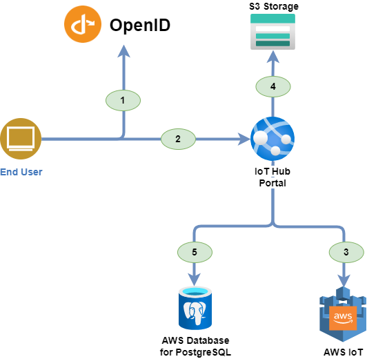

# AWS configurations

## Overall Architecture

This schema represent the various components and how they interact to have a better understanding of the various solution elements.



1. The user is authenticated by the OpenID Connect server.
1. The user access to the IoT Hub Portal with the OAuth2.0 token.
1. The IoT Hub portal uses the AWS IoT REST API to retrieve the data.
1. The IoT Hub portal uses the AWS S3 storage to store the device models configuration (Images, Commands, etc.).
1. The IoT Hub portal synchronizes its data with the IoT Hub to provide a consistent view of the data.

## Quick Start

### Prerequisites

* You must have an AWS Account. Get an [AWS Free account](https://portal.aws.amazon.com/billing/signup#/start/email) to get started.

### Deployed Resources

The template will deploy in your AWS Account the Following resources:  

* AWS RDS - Database for PostgreSQL
* AWS S3 Bucket
* AWS App Runner Service

### Instructions

1. Choose a stack name for your AWS Deployment.

1. Follow next step below to start your deployment:

    1. Press on the button here below to download the template AWS:  
    [Download the template](https://github.com/CGI-FR/IoT-Hub-Portal/blob/1940-cloudformation-script-creation/templates/aws/awsdeploy.yml)

    1. Import your template :  
        ***From the AWS console: [CloudFormation new stack](https://eu-west-1.console.aws.amazon.com/cloudformation/home?region=eu-west-1#/stacks/create)***  
            - You can change the deployment region by changing the region directly in the URL  
            - In "Upload a template file" import the previously downloaded file  
        ***With AWS CLI:***

        ```console
        aws cloudformation deploy --template /path_to_template/awsdeploy.yml --stack-name your-stack-name --region your-region
        ```

        > see: [https://docs.aws.amazon.com/AWSCloudFormation/latest/UserGuide/using-cfn-cli-deploy.html](https://docs.aws.amazon.com/AWSCloudFormation/latest/UserGuide/using-cfn-cli-deploy.html) for more option about aws cloudformation deploy

1. You will get to a page asking you to fill the following fields:
    * **Stack Name**: A name for the stack where all the template resource would be put into, just choose a meaningful name.
    * **Unique Solution Prefix**: A string that would be used as prefix for all the resources name to ensure their uniqueness.
    * **PostgreSQL user**: The PostgreSQL user name to be used for the IoT Hub Portal database.
    * **PostgreSQL password**: The PostgreSQL password to be used for the IoT Hub Portal database.
    * **AWS Access Key**: The AWS Access Key of your AWS environment.
    * **AWS Access Secret Key**: The AWS Access Secret Key of your AWS environment.
    * **Api Client Id**: the ID of the API client that will be used to authenticate the portal.
    * **Client Id**: the ID of the web client that will be used to authenticate the portal.
    * **Open Id Authority**: The OpenID authority used by the portal.
    * **OpenId Metadata URL**: The OpenID metadata URL used by the portal.
    * **OpenId Scope Name**: The Open ID Scope name

## Configurations

This configurations are used to get access to AWS cloud Platform. You have to enter them in a `json` file to be able to connect to the Iot Hub Portal. Here is a template of a such `json` file.

```json
{
  "CloudProvider": "AWS",
  "AWS:Access": "<AWS_ACCESS_KEY>",
  "AWS:AccessSecret": "<AWS_ACCESS_SECRET_KEY>",
  "AWS:Region": "<AWS_REGION_KEY>",
  "AWS:BucketName": "<AWS_BUCKET_NAME>",
  "OIDC:Scope": "<SCOPE>",
  "OIDC:MetadataUrl": "<METADATA_URL>",
  "OIDC:ClientId": "<CLIENT_ID>",
  "OIDC:Authority": "<AUTHORITY>",
  "OIDC:ApiClientId": "<API_CLIENT_ID>",
  "PostgreSQL:ConnectionString": "<POSTGRE_SQL_CONNECTION_STRING>",
}
```

> <u>Note:</u> You must replace all values in the brackets by your own AWS settings. If you can't find them in the AWS Portal, please contact an administrator of this project to have more information.

You are now ready to start your IoT Hub Portal development !
