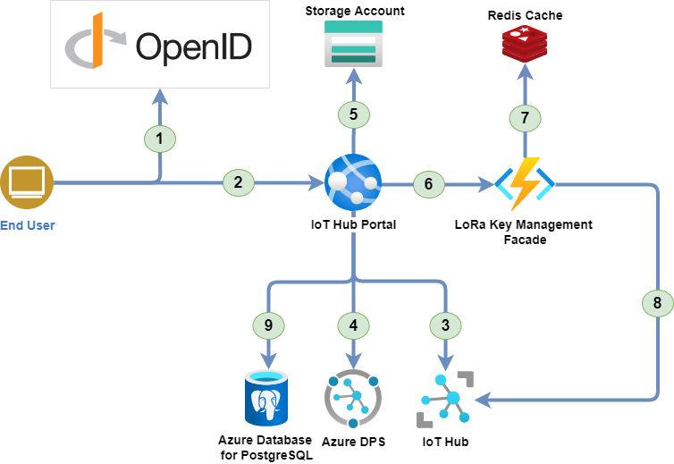

# Azure Configurations

## Overall Architecture

This schema represent the various components and how they interact to have a better understanding of the various solution elements.



1. The user is authenticated by the OpenID Connect server.
1. The user access to the IoT Hub Portal with the OAuth2.0 token.
1. The IoT Hub portal uses the Azure IoT Hub REST API to retrieve the data.
1. The IoT Hub portal uses the Azure Device Provisioning Service to manage IoT Edge devices.
1. The IoT Hub portal uses the Azure Storage account to store the device models configuration (Images, Commands, etc.).
1. The IoT Hub portal uses the LoRa Key Management Facade to send Cloud to Device (C2D) messages to LoRa devices.
1. The LoRa Key Management Facade uses Redis to store its cached data.
1. The LoRa Key Management Facade uses the Azure IoT Hub REST API to retrieve the LoRa device keys and send C2D messages.
1. The IoT Hub portal synchronizes its data with the IoT Hub to provide a consistent view of the data.

> Note: For more information about the LoRa Key Management Facade, see the [Azure IoT Edge LoRaWAN Starter Kit](https://azure.github.io/iotedge-lorawan-starterkit) page.

## Quick Start

### Prerequisites

* You must have an Azure subscription. Get an [Azure Free account](https://azure.microsoft.com/en-us/offers/ms-azr-0044p/) to get started.
* You must have configured an Azure AD B2C Tenant with applications. See [Portal AD applications configuration](https://cgi-fr.github.io/IoT-Hub-Portal/stable/b2c-applications) page.
* Understand how IoT Edge LoraWAN StarterKit work. Have a look at [https://azure.github.io/iotedge-lorawan-starterkit](https://azure.github.io/iotedge-lorawan-starterkit) to get started.

### Deployed Resources

The template will deploy in your Azure subscription the Following resources:  

* IoT Hub
* Azure Function and Consumption Service Plan
* Redis Cache
* Application Insights
* Log Analytics (when opted in to use Azure Monitor)
* Azure WebApp and Service Plan
* Azure Database for PostgreSQL

### Instructions

1. Choose a solution prefix for your Azure Deployment.

1. Configure your AD to connect to the portal.
    Use [Portal AD applications configuration](https://cgi-fr.github.io/IoT-Hub-Portal/stable/b2c-applications) page to configure your AD B2C Tenant :

    > You should have recorded the following information:  
    >
    > * OpenID authority: `<your-openid-authority>`  
    > * OpenID metadata URL: `<your-openid-provider-metadata-url>`  
    > * Client ID: `<your-client-id>`  
    > * API Client ID: `<your-client-id>`

1. Press on the button here below to start your deployment on Azure:  
    [](https://portal.azure.com/#create/Microsoft.Template/uri/https%3A%2F%2Fraw.githubusercontent.com%2FCGI-FR%2FIoT-Hub-Portal%2Farm%2Fmain%2Ftemplates%2Fazuredeploy.json/uiFormDefinitionUri/https%3A%2F%2Fraw.githubusercontent.com%2FCGI-FR%2FIoT-Hub-Portal%2Farm%2Fmain%2Ftemplates%2FazuredeployUI.json)

1. You will get to a page asking you to fill the following fields:
    * **Resource Group**: A logical "folder" where all the template resource would be put into, just choose a meaningful name.
    * **Location**: In which DataCenter the resources should be deployed. Make sure to choose a location where IoT Hub is available
    * **Unique Solution Prefix**: A string that would be used as prefix for all the resources name to ensure their uniqueness.
    * **PostgreSQL user**: The PostgreSQL user name to be used for the IoT Hub Portal database.
    * **PostgreSQL password**: The PostgreSQL password to be used for the IoT Hub Portal database.
    * **Confirm PostgreSQL password**: The PostgreSQL password to be used for the IoT Hub Portal database.
    * **Open Id Authority**: The OpenID authority used by the portal.
    * **OpenId Metadata URL**: The OpenID metadata URL used by the portal.
    * **Client Id**: the ID of the web client that will be used to authenticate the portal.
    * **Api Client Id**: the ID of the API client that will be used to authenticate the portal.
    * **Edge gateway name**: the name of your LoRa Gateway node in the IoT Hub.
    * **Deploy Device**: Do you want demo end devices to be already provisioned (one using OTAA and one using ABP)? If yes set this to true, the code located in the Arduino folder would be ready to use immediately.
    * **Reset pin**:  The reset pin of your gateway (the value should be 7 for the Seed Studio LoRaWan, 25 for the IC880A)
    * **Region**:  In what region are you operating your device (currently only EU868 and US915 is supported)

    > see: [https://azure.github.io/iotedge-lorawan-starterkit/dev/quickstart/#deployed-azure-infrastructure](https://azure.github.io/iotedge-lorawan-starterkit/dev/quickstart/#deployed-azure-infrastructure) for more information about the LoRaWan IoT Hub and Azure deployment.

## Configurations/Secrets

_Secrets_ are used to fill in the login credentials to the cloud platform. You have to enter them in a `json` file to be able to connect to the IoT Hub Portal. Here is a template of a such `json` file :

```json
{
  "CloudProvider": "Azure",
  "StorageAccount:ConnectionString": "<CONNECTION_STRING_STORAGE_ACCOUNT>",
  "StorageAccount:BlobContainerName": "<BLOB_CONTAINER_NAME>",
  "OIDC:Scope": "<SCOPE>",
  "OIDC:MetadataUrl": "<METADATA_URL>",
  "OIDC:ClientId": "<CLIENT_ID>",
  "OIDC:Authority": "<AUTHORITY>",
  "OIDC:ApiClientId": "<API_CLIENT_ID>",
  "LoRaRegionRouterConfig:Url": "<LORA_WAN_ROUTER_CONFIGURATION_URL>",
  "LoRaKeyManagement:Url": "<LORA_WAN_KEY_MANAGEMENT_URL>",
  "LoRaKeyManagement:Code": "<LORA_WAN_KEY_MANAGEMENT_CODE>",
  "LoRaFeature:Enabled": "<TRUE_OR_FALSE>",
  "Kestrel:Certificates:Development:Password": "<DEV_PASSWORD>",
  "IoTHub:ConnectionString": "<IOT_HUB_CONNECTION_STRING>",
  "IoTHub:EventHub:Endpoint": "<IOT_HUB_EVENT_HUB_ENDPOINT>",
  "IoTHub:EventHub:ConsumerGroup": "<IOT_HUB_EVENT_HUB_CONSUMER_GROUP>",
  "IoTDPS:ServiceEndpoint": "<SERVICE_END_POINT>",
  "IoTDPS:LoRaEnrollmentGroup": "<LORA_WAN_ENROLLMENT_GROUP>",
  "IoTDPS:DefaultEnrollmentGroup": "<LORA_WAN_DEFAULT_ENROLLMENT_GROUP>",
  "IoTDPS:ConnectionString": "<IOT_DPS_CONNECTION_STRING>",
  "PostgreSQL:ConnectionString": "<POSTGRE_SQL_CONNECTION_STRING>"
}
```

> <u>Note:</u> You must replace all values in the brackets by your own Azure settings. If you can't find them in the Azure Portal, please contact an administrator of this project to have more information.

This `json` file must be added into your project solution. To do that, click on the `AzureIoTHub.Server` project in Visual Studio and select `Manage User Secrets` from the context menu. You can now add your secrets inside this file.

You are now ready to start your IoT Hub Portal development !
