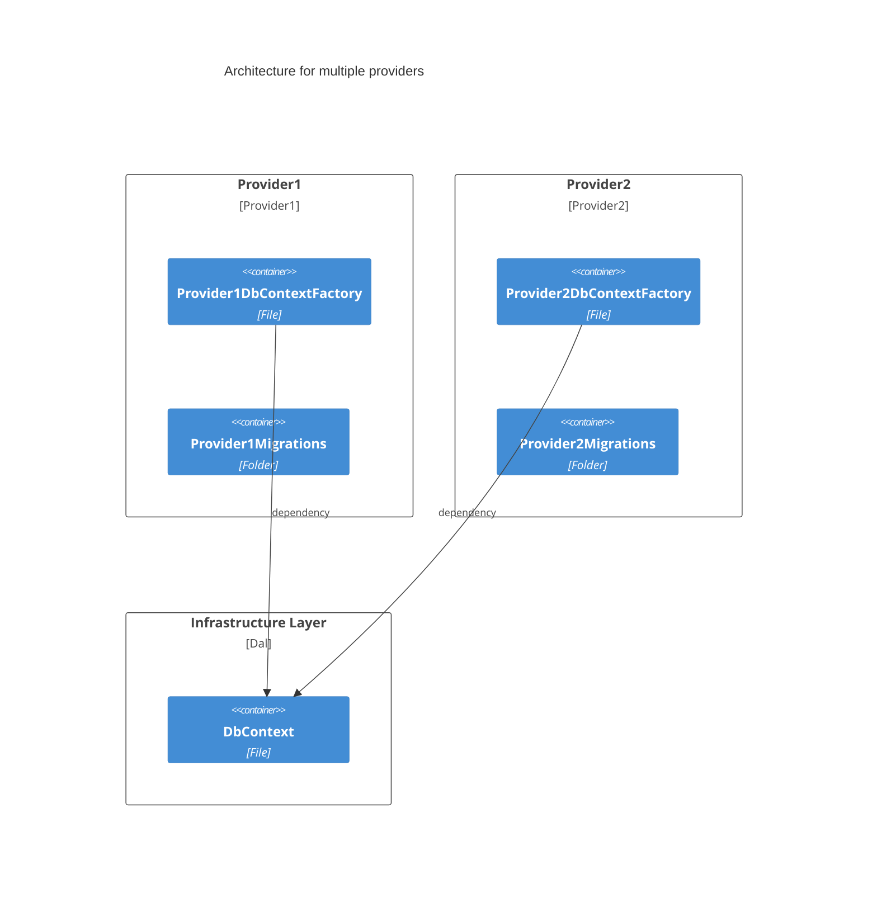

# Developer Guide

## Directory Structure

The code is organized into the following directory structure:

* **src**: Source code
  * **AzureIoTHub.Portal.Server.Tests**: Unit test project for the Portal
  * **AzureIoTHub.Portal**: The Portal project
    * **Client**: .NET 6 Blazor Web Assembly project that alow to visualize the IoT Hub data
    * **Server**: .NET 6 Web API project that provides the API for the Portal
    * **Shared**: Shared code between the Client and Server projects
* **templates**: contains the templates for the "deploy to Azure" button

## Overall Architecture

This schema represent the various components and how they interact to have a better understanding of the various solution elements.


1. The user is authenticated by the OpenID Connect server.
1. The user access to the IoT Hub Portal with the OAuth2.0 token.
1. The IoT Hub portal uses the Azure IoT Hub REST API to retrieve the data.
1. The IoT Hub portal uses the Azure Device Provisioning Service to manage IoT Edge devices.
1. The IoT Hub portal uses the Azure Storage account to store the device models configuration (Images, Commands, etc.).
1. The IoT Hub portal uses the LoRa Key Management Facade to send Cloud to Device (C2D) messages to LoRa devices.
1. The LoRa Key Management Facade uses Redis to store its cached data.
1. The LoRa Key Management Facade uses the Azure IoT Hub REST API to retrieve the LoRa device keys and send C2D messages.
1. The IoT Hub portal synchronizes its data with the IoT Hub to provide a consistent view of the data.

> Note: For more information about the LoRa Key Management Facade, see the [Azure IoT Edge LoRaWAN Starter Kit](https://azure.github.io/iotedge-lorawan-starterkit) page.

## Prerequisites

The following should be completed before proceeding with the IoT Hub Portal development or deployment in your environment.

Before getting started, it is better to master the tools below:

* Azure platform and Azure IoT Hub. A tutorial can be found [here](https://docs.microsoft.com/en-us/learn/paths/ai-edge-engineer/).
* Blazor WebAssembly and Blazor Server. A traning is available [on this site](https://docs.microsoft.com/en-us/learn/paths/build-web-apps-with-blazor/).
* Docker. An introduction to containerization is available [on this page](https://docs.microsoft.com/en-us/dotnet/architecture/microservices/container-docker-introduction/).
* IoTEdge LoraWAN StarterKit. Have a look at [LoRaWAN Starter Kit](https://azure.github.io/iotedge-lorawan-starterkit) to get more details on this OSS cross platform private network.

-----------------

Once you know the basics of these technologies and tools, you must follow these last steps to set up your working environment.

* IoT Hub Portal uses containers to work correctly. [Docker](https://www.docker.com/) is required to launch this project (version >= 4.11.1).

> Once you have download Docker, you must install the WSL 2 Linux kernel. To do that, please refer to the official [Microsoft documentation](https://aka.ms/wsl2kernel). You can choose the linux distribution of your choice, for example Ubuntu.

* Node.js is used to run JavaScript code in the portal. You can download the latest version [here](https://nodejs.org/en/).The minimal version required is 16.17.0.
* You must have an Azure subscription. [Get an Azure Free account to start](https://azure.microsoft.com/en-gb/free/).
* An Identity provider supporting OpenIDConnect protocol configured with 2 applications (API and web) is required to login to the IoT Hub Portal. See [Azure AD B2C Tenant with applications](https://cgi-fr.github.io/IoT-Hub-Portal/stable/b2c-applications/) configuration page for example.
* To develop, you can choose your own IDE or text editor, for example [Visual Studio](https://visualstudio.microsoft.com/).

### Secrets

_Secrets_ are used to fill in the login credentials to the cloud platform. You have to enter them in a `json` file to be able to connect to the IoT Hub Portal. Here is a template of a such `json` file :

```json
{
  "StorageAccount:ConnectionString": "<CONNECTION_STRING_STORAGE_ACCOUNT>",
  "StorageAccount:BlobContainerName": "<BLOB_CONTAINER_NAME>",
  "OIDC:Scope": "<SCOPE>",
  "OIDC:MetadataUrl": "<METADATA_URL>",
  "OIDC:ClientId": "<CLIENT_ID>",
  "OIDC:Authority": "<AUTHORITY>",
  "OIDC:ApiClientId": "<API_CLIENT_ID>",
  "LoRaRegionRouterConfig:Url": "<LORA_WAN_ROUTER_CONFIGURATION_URL>",
  "LoRaKeyManagement:Url": "<LORA_WAN_KEY_MANAGEMENT_URL>",
  "LoRaKeyManagement:Code": "<LORA_WAN_KEY_MANAGEMENT_CODE>",
  "LoRaFeature:Enabled": "<TRUE_OR_FALSE>",
  "Kestrel:Certificates:Development:Password": "<DEV_PASSWORD>",
  "IoTHub:ConnectionString": "<IOT_HUB_CONNECTION_STRING>",
  "IoTHub:EventHub:Endpoint": "<IOT_HUB_EVENT_HUB_ENDPOINT>",
  "IoTHub:EventHub:ConsumerGroup": "<IOT_HUB_EVENT_HUB_CONSUMER_GROUP>",
  "IoTDPS:ServiceEndpoint": "<SERVICE_END_POINT>",
  "IoTDPS:LoRaEnrollmentGroup": "<LORA_WAN_ENROLLMENT_GROUP>",
  "IoTDPS:DefaultEnrollmentGroup": "<LORA_WAN_DEFAULT_ENROLLMENT_GROUP>",
  "IoTDPS:ConnectionString": "<IOT_DPS_CONNECTION_STRING>",
  "PostgreSQL:ConnectionString": "<POSTGRE_SQL_CONNECTION_STRING>"
}
```

> <u>Note:</u> You must replace all values in the brackets by your own Azure settings. If you can't find them in the Azure Portal, please contact an administrator of this project to have more information.

This `json` file must be added into your project solution. To do that, click on the `AzureIoTHub.Server` project in Visual Studio and select `Manage User Secrets` from the context menu. You can now add your secrets inside this file.

You are now ready to start your IoT Hub Portal development !

## IoT Hub Portal Configuration

By deploying the IoT Hub Portal, the user can configure the IoT Hub and the LoRaWAN network.

Since the IoT Hub Portal is deployed as a Docker container, the application settings can be configured with environment variables.

### Application settings

Here are different settings that the user can configure:

* **PortalName**: The name of the portal (shown in the App Bar and the Page Title).
* **OIDC__Authority**: The OpenID Connect issuer.
* **OIDC__MetadataUrl**: The OpenID Connect metadata URL (e.g. `.well-known/openid-configuration`).
* **OIDC__ClientId**: The OpenID Connect client ID for the Web UI.
* **OIDC__ApiClientId**: The OpenID Connect client ID for the API.
* **OIDC__Scope**: The OpenID Connect scope that represents the portal API.
* **IoTDPS__ServiceEndpoint**: The IoT Device Provisioning Service endpoint.
* **IoTDPS__IDScope**: The IoT Device Provisioning Service ID scope.
* **LoRaFeature__Enabled**: Whether the LoRaWAN feature is enabled or not.
* **LoRaKeyManagement__Url**: The LoRa Key Management Facade URL.
* **StorageAccount__BlobContainerName**: The name of the Azure Storage container where the device models images are stored.
* **IoTHub__EventHub__Endpoint**: The IotHub Event Hub compatible endpoint.
* **IoTHub__EventHub__ConsumerGroup**: (Default value `iothub-portal`) The name of the consumer group used to to pull data from the IoT Hub (Automatically created by the Bicep/ARM deployement)
* **ASPNETCORE_ENVIRONMENT**: Built-in environment variable, used to target the configuration provided by a specific environment. Two accepted values:
  * `Development`: On this environment, logs are produced up to `Debug` level.
  * `Production`: Default value if ASPNETCORE_ENVIRONMENT is not set. On this environment, logs are produced up to `Information` level.
* **Metrics__ExporterRefreshIntervalInSeconds**: (Optional, default value `30`) The refresh interval in `seconds` to collect custom metrics and expose them to the exporter endpoint.
* **Metrics__LoaderRefreshIntervalInMinutes**: (Optional, default value `10`) The refresh interval in `minutes` to calculate/refresh custom metrics values.
* **Ideas__Enabled**: (Optional, default value `false`) To enable Ideas feature when set to `true`.
* **Ideas__Url**: Url of `Awesome-Ideas`, to publish ideas submitted by users.
* **Ideas__Authentication__Header**: (Optional, default value `Ocp-Apim-Subscription-Key`) Authentication header name.
* **Ideas__Authentication__Token**: Authentication token.
* **Job__SyncDatabaseJobRefreshIntervalInMinutes**: (Optional, default value `5`) The refresh interval in `minutes` to collect data from Azure IoT Hub (Devices, Iot Edge Devices...) and store them on the database of the Portal.
* **Job__SendCommandsToDevicesIntervalInMinutes**: (Optional, default value `10`) The interval in `minutes` to send scheduled commands to devices.

### Connection strings

Here are different connection strings that the user can configure:

* **IoTHub__ConnectionString**: The connection string to the IoT Hub.
* **IoTDPS__ConnectionString**: The connection string to the Azure IoT Device Provisioning Service.
* **StorageAccount__ConnectionString**: The connection string to the Azure Storage account.
* **LoRaKeyManagement__Code**: The LoRa Key Management Facade code.
* **PostgreSQL__ConnectionString**: The connection string allowing the connection to the PostgreSQL database.

> Note: For a production environment, an Azure Key Vault is advised to store the connection strings.

### Optional Security Settings

There are several optional security settings that the user can configure. These settings are not required for the Portal to work. By default the Portal is configured to set security levels to ``Microsoft.IdentityModel.Tokens`` defaults but the user can override these settings.

* UseSecurityHeaders
  > This boolean adds the following headers to all responses :
  >
  > `X-Content-Type-Options: nosniff`
  >
  > `Strict-Transport-Security: max-age=31536000; includeSubDomains` - _only applied to HTTPS responses_
  >
  >
  > `X-Frame-Options: Deny` - _only applied to text/html responses_
  >
  > `X-XSS-Protection: 1; mode=block` - _only applied to text/html responses_
  >
  > `Referrer-Policy: strict-origin-when-cross-origin` - _only applied to text/html responses_
  >
  > `Content-Security-Policy: object-src 'none'; form-action 'self'; frame-ancestors 'none'` - _only applied to text/html responses_.
  >
  > The **default is true**.
* OIDC__ValidateIssuer
  > Validation of the issuer mitigates forwarding attacks that can occur when an IdentityProvider represents multiple tenants and signs tokens with the same keys. It is possible that a token issued for the same audience could be from a different tenant. For example an application could accept users from contoso.onmicrosoft.com but not fabrikam.onmicrosoft.com, both valid tenants. An application that accepts tokens from fabrikam could forward them to the application that accepts tokens for contoso. This boolean only applies to default issuer validation. If [IssuerValidator](https://docs.microsoft.com/en-us/dotnet/api/microsoft.identitymodel.tokens.tokenvalidationparameters.issuervalidator?view=azure-dotnet#microsoft-identitymodel-tokens-tokenvalidationparameters-issuervalidator) is set, it will be called regardless of whether this property is true or false.
  >
  > The **default is true**.
* OIDC__ValidateAudience
  > Validation of the audience, mitigates forwarding attacks. For example, a site that receives a token, could not replay it to another side. A forwarded token would contain the audience of the original site. This boolean only applies to default audience validation. If [AudienceValidator](https://docs.microsoft.com/en-us/dotnet/api/microsoft.identitymodel.tokens.tokenvalidationparameters.audiencevalidator?view=azure-dotnet#microsoft-identitymodel-tokens-tokenvalidationparameters-audiencevalidator) is set, it will be called regardless of whether this property is true or false.
  >
  > The **default is true**.
* OIDC__ValidateLifetime
  > This boolean only applies to default lifetime validation. If [LifetimeValidator](https://docs.microsoft.com/en-us/dotnet/api/microsoft.identitymodel.tokens.tokenvalidationparameters.lifetimevalidator?view=azure-dotnet#microsoft-identitymodel-tokens-tokenvalidationparameters-lifetimevalidator) is set, it will be called regardless of whether this property is true or false.
  >
  > The **default is true**.
* OIDC__ValidateIssuerSigningKey
  > It is possible for tokens to contain the public key needed to check the signature. For example, X509Data can be hydrated into an X509Certificate, which can be used to validate the signature. In these cases it is important to validate the SigningKey that was used to validate the signature. This boolean only applies to default signing key validation. If [IssuerSigningKeyValidator](https://docs.microsoft.com/en-us/dotnet/api/microsoft.identitymodel.tokens.tokenvalidationparameters.issuersigningkeyvalidator?view=azure-dotnet#microsoft-identitymodel-tokens-tokenvalidationparameters-issuersigningkeyvalidator) is set, it will be called regardless of whether this property is true or false.
  >
  > The **default is false**.
* OIDC_ValidateActor
  > If an actor token is detected, whether it should be validated.
  >
  > The **default is false**.
* OIDC_ValidateTokenReplay
  > This boolean only applies to default token replay validation. If [TokenReplayValidator](https://docs.microsoft.com/fr-fr/dotnet/api/microsoft.identitymodel.tokens.tokenvalidationparameters.tokenreplayvalidator?view=azure-dotnet#microsoft-identitymodel-tokens-tokenvalidationparameters-tokenreplayvalidator) is set, it will be called regardless of whether this property is true or false.
  >
  > The **default is false**.

## Device tags

The IoT Hub portal uses some tags to configure the devices. The tags are stored in the Azure IoT Hub in Device Twins.

* **modelId**: The device model ID that is used to retrieve the device model configuration.

## Storage Account

The Storage Account is used to store the device models images. You can use the same Storage Account that is used by the LoRa Key Management Facade.
This solution will use tables and blob storage to store its data. There is no need to create the containers, the application will do it for you.

### Blob Storage

The application uses the following blob storage:

* **device-images**: The blob storage that contains the device images.

## Working with the documentation

This documentation site is build using [Material for MkDocs](https://github.com/squidfunk/mkdocs-material) and [Mike](https://github.com/jimporter/mike).

```docs/main``` is a detached branch that is locked and only accepts PRs. On PR merge, Github Pages will automatically update the documentation website.

## How to update the documentation

1. Checkout the branch that contains the documentation:

    ```console
    git checkout origin/docs/main
    git checkout -b docs/<your_branch_name> 
    ```

1. Install dependencies

    ```console
    pip install -r requirements.txt
    ```

1. Previewing as you write

    ```console
    mkdocs serve
    ```

1. PRs are gated by a markdownlint check. You should use markdownlint to lint any new changes on documentation. For example you can use the vs code extension [https://marketplace.visualstudio.com/items?itemName=DavidAnson.vscode-markdownlint](https://marketplace.visualstudio.com/items?itemName=DavidAnson.vscode-markdownlint)
1. Update the documentation
1. Commit your changes
1. Push your changes to the branch
1. Create a PR

### Customization

Refer to Material for MkDocs documentations:

* [https://squidfunk.github.io/mkdocs-material/customization](https://squidfunk.github.io/mkdocs-material/customization/)
* [https://squidfunk.github.io/mkdocs-material/setup](https://squidfunk.github.io/mkdocs-material/setup)

### Versioning

[Mike](https://github.com/jimporter/mike) is used to generate automatically a new documentation version when a release has been published, using ci/cd pipelines.

For manual workflows (e.g. delete or retitle an existing version), please refer to [Mike documentation](https://github.com/jimporter/mike)

## Problem Details

On IoT Hub Portal, we use the library [Hellang.Middleware.ProblemDetails](https://github.com/khellang/Middleware) which implements [RFC7807](https://datatracker.ietf.org/doc/html/rfc7807) to describe issues/problems that occurred on backend.

### Handle a new exception using `Problem Details`

* Create a new exception which extends [`BaseException`](https://github.com/CGI-FR/IoT-Hub-Portal/blob/main/src/AzureIoTHub.Portal/Server/Exceptions/BaseException.cs). For example see 👉 [`InternalServerErrorException`](https://github.com/CGI-FR/IoT-Hub-Portal/blob/main/src/AzureIoTHub.Portal/Server/Exceptions/InternalServerErrorException.cs)
* On [Startup](https://github.com/CGI-FR/IoT-Hub-Portal/blob/main/src/AzureIoTHub.Portal/Server/Startup.cs) class, within the instruction `services.AddProblemDetails()`:
    > Your new exception is already catched by the middleware Problem Details because its extends the exception `BaseException`.
    > If you want override the behavior of the middleware when processing your exception, you have to add a new mapping within it.

> 💡 You can also map exceptions from dotnet framework and third parties.

### Handle `Problem Details` exceptions on frontend

On frontend, http client uses a delegating handler [ProblemDetailsHandler](https://github.com/CGI-FR/IoT-Hub-Portal/blob/main/src/AzureIoTHub.Portal/Client/Handlers/ProblemDetailsHandler.cs) to:

* Execute the http request and wait the response
* If the response is not successful:
  * The body of the response is deserialized to `ProblemDetailsWithExceptionDetails`
  * An exception with type `ProblemDetailsException` (including the error response) is thrown.

On Blazor views, http calls must be catched to capture any exceptions of type `ProblemDetailsException` to be able to execute any business code to process them.

When an http call fails, the user must be notified visually by the application: A component [Error](https://github.com/CGI-FR/IoT-Hub-Portal/blob/main/src/AzureIoTHub.Portal/Client/Shared/NavMenu.razor) has been made to respond to this use case.
Below an example on how to:

* Catch an ProblemDetailsException when making a http call
* Delegate the exception to the `Error` component, so that it can visually warn the user

```csharp
@code {
    // Inject the reference to the Error component as a cascading parameter
    [CascadingParameter]
    public Error Error {get; set;}

    private await Task GetData()
    {
        try
        {
            // Execute an http request
        }
        catch (ProblemDetailsException exception)
        {
            // Pass the ProblemDetailsException exception to Error component using its method ProcessProblemDetails()
            // The Error component will alert the user by showing a (snackbar/dialog) using the content of the exception
            Error?.ProcessProblemDetails(exception)
        }
    }
}
```

## How to install Entity Framework Core

Follow the next step to install EF Core:

1. Open the terminal and run this command:

    ```console
    dotnet tool install --global dotnet-ef
    ```

## How to create EntityFramework migrations for PostgreSQL and MySQL

For the project need, we need two database providers which are PostgreSQL and MySQL, which led us to review the architecture set up for the EntityFramework migrations. Here is a diagram showing the two architectures.



Follow the next steps to create EF migration:

1. Go into the Server project folder with terminal

    ```console
    cd .\IoTHub.Portal.Server\
    ```

1. Execute this command for PostgreSQL provider

    ```console
    dotnet ef migrations add "<nameofyourmigration>" -p ..\IoTHub.Portal.Postgres\ -v -- --DbProvider PostgreSQL
    ```

1. Execute this command for MySQL provider

    ```console
    dotnet ef migrations add "<nameofyourmigration>" -p ..\IoTHub.Portal.MySql\ -v -- --DbProvider MySQL
    ```

1. Open the created migration and follow the following steps:

    1. Move the using directive into the namespace directive

    1. Add "_ =" before each statement of the Up and Down methods

    1. Add the CGI copyright to the top of the file
