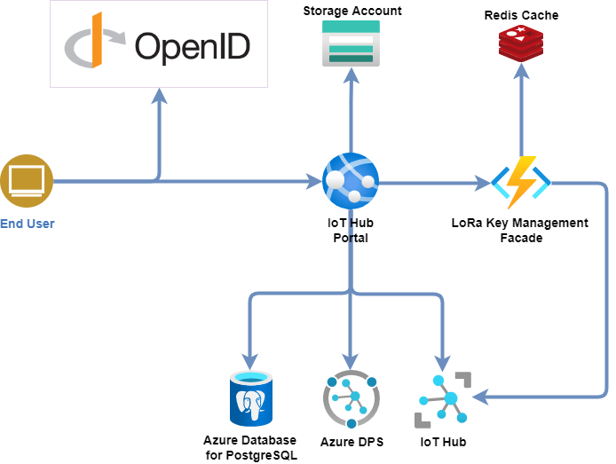

# IoT Hub Portal

This project aims to provide a solution for handling IoT Devices easyly.
It leverages on Azure IoT Hub or AWS IoT Core for connectivity and device management.



## Features

* Portal Authentication
* IoT Device & device Model management
* IoT Edge device management
* C2D Methods
* LoRA WAN device connectivity

## Prerequisites

The following should be completed before proceeding with the IoT Hub Portal development or deployment in your environment.

**Azure**
* You must have an Azure subscription. Get an [Azure Free account](https://azure.microsoft.com/en-us/offers/ms-azr-0044p/) to get started.
* You must have configured an Azure AD B2C Tenant with applications. See [Portal AD applications configuration](https://cgi-fr.github.io/IoT-Hub-Portal/stable/b2c-applications) page.
* Understand how IoT Edge LoraWAN StarterKit work. Have a look at [https://azure.github.io/iotedge-lorawan-starterkit](https://azure.github.io/iotedge-lorawan-starterkit) to get started.

**Amazon Web Services**
* You must have an AWS Account. Get an [AWS Free account](https://portal.aws.amazon.com/billing/signup#/start/email) to get started.

## Quick Start

### Deployed Resources

**Azure**  
The template will deploy in your Azure subscription the Following resources:  

* IoT Hub
* Azure Function and Consumption Service Plan
* Redis Cache
* Application Insights
* Log Analytics (when opted in to use Azure Monitor)
* Azure WebApp and Service Plan
* Azure Database for PostgreSQL

**Amazon Web Services**  
The template will deploy in your AWS Account the Following resources:  

* AWS RDS - Database for PostgreSQL
* AWS S3 Bucket
* AWS App Runner Service

### Instructions

1. Choose a solution prefix for your Azure Deployment or a stack name for your AWS Deployment.

1. Configure your AD to connect to the portal.  

    **Azure**

    Use [Portal AD applications configuration](https://cgi-fr.github.io/IoT-Hub-Portal/stable/b2c-applications) page to configure your AD B2C Tenant :
    > You should have recorded the following information:
    > * OpenID authority: `<your-openid-authority>`
    > * OpenID metadata URL: `<your-openid-provider-metadata-url>`
    > * Client ID: `<your-client-id>`
    > * API Client ID: `<your-client-id>`

1. Follow next step below to start your deployment.

    **Azure**

    Press on the button here below to start your deployment on Azure:  
    [](https://portal.azure.com/#create/Microsoft.Template/uri/https%3A%2F%2Fraw.githubusercontent.com%2FCGI-FR%2FIoT-Hub-Portal%2Farm%2Fmain%2Ftemplates%2Fazuredeploy.json/uiFormDefinitionUri/https%3A%2F%2Fraw.githubusercontent.com%2FCGI-FR%2FIoT-Hub-Portal%2Farm%2Fmain%2Ftemplates%2FazuredeployUI.json)

    **Amazon Web Services**  

    1. Press on the button here below to download the template AWS:  
    [Download the template](https://github.com/CGI-FR/IoT-Hub-Portal/blob/1940-cloudformation-script-creation/templates/aws/awsdeploy.yml)

    1. Import your template :
       * From the AWS console: [CloudFormation new stack](https://eu-west-1.console.aws.amazon.com/cloudformation/home?region=eu-west-1#/stacks/create)  
            * You can change the deployment region by changing the region directly in the URL
            * In "Upload a template file" import the previously downloaded file
       * With AWS CLI:
            ```
            aws cloudformation deploy --template /path_to_template/awsdeploy.yml --stack-name your-stack-name --region your-region
            ```
            > see: https://docs.aws.amazon.com/AWSCloudFormation/latest/UserGuide/using-cfn-cli-deploy.html for more option about aws cloudformation deploy

1. You will get to a page asking you to fill the following fields :

    **Azure**
    * **Resource Group**: A logical "folder" where all the template resource would be put into, just choose a meaningful name.
    * **Location**: In which DataCenter the resources should be deployed. Make sure to choose a location where IoT Hub is available
    * **Unique Solution Prefix**: A string that would be used as prefix for all the resources name to ensure their uniqueness.
    * **PostgreSQL user**: The PostgreSQL user name to be used for the IoT Hub Portal database.
    * **PostgreSQL password**: The PostgreSQL password to be used for the IoT Hub Portal database.
    * **Confirm PostgreSQL password**: The PostgreSQL password to be used for the IoT Hub Portal database.
    * **Open Id Authority**: The OpenID authority used by the portal.
    * **OpenId Metadata URL**: The OpenID metadata URL used by the portal.
    * **Client Id**: the ID of the web client that will be used to authenticate the portal.
    * **Api Client Id**: the ID of the API client that will be used to authenticate the portal.
    * **Edge gateway name**: the name of your LoRa Gateway node in the IoT Hub.
    * **Deploy Device**: Do you want demo end devices to be already provisioned (one using OTAA and one using ABP)? If yes set this to true, the code located in the Arduino folder would be ready to use immediately.
    * **Reset pin**:  The reset pin of your gateway (the value should be 7 for the Seed Studio LoRaWan, 25 for the IC880A)
    * **Region**:  In what region are you operating your device (currently only EU868 and US915 is supported)

    > see: [https://azure.github.io/iotedge-lorawan-starterkit/dev/quickstart/#deployed-azure-infrastructure](https://azure.github.io/iotedge-lorawan-starterkit/dev/quickstart/#deployed-azure-infrastructure) for more information about the LoRaWan IoT Hub and Azure deployment.

    **Amazon Web Services**
    * **Stack Name**: A name for the stack, just choose a meaningful name.
    * **Service Name**: A name for the App Runner service.
    * **PostgreSQL user**: The PostgreSQL user name to be used for the IoT Hub Portal database.
    * **PostgreSQL password**: The PostgreSQL password to be used for the IoT Hub Portal database.
    * **Region**: Region code
    * **Api Client Id**: the ID of the API client that will be used to authenticate the portal.
    * **Client Id**: the ID of the web client that will be used to authenticate the portal.
    * **Open Id Authority**: The OpenID authority used by the portal.
    * **OpenId Metadata URL**: The OpenID metadata URL used by the portal.
    * **OpenId Scope Name**: The Open ID Scope name

## Known Issues and Limitations

Refer to [Known Issues](knownissues) for known issues, gotchas and limitations.

## Support

This is an open source solution.
For bugs and issues with the codebase please log an issue in this repo.

## Credits

* [Azure IoT Edge LoRaWAN Starter Kit](https://github.com/Azure/iotedge-lorawan-starterkit)
