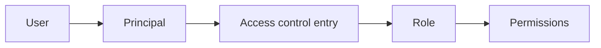

# Role-Based Access Control

The IoT Hub Portal uses role-based access control (RBAC) to decide which authenticated users can view or change portal resources. Access is granted by assigning one or more roles to a user's principal.

## RBAC Model

- **User**: The authenticated portal account, identified by its email claim.
- **Principal**: The identity anchor used by authorization. A user can have multiple access-control entries through its principal.
- **Role**: A named collection of permissions, such as read or write capabilities.
- **Access control entry**: Assigns a role to a principal.
- **Permission**: A fixed `resource:action` identifier checked by the API and UI.

Permissions are additive. If any assigned role grants the required permission, authorization succeeds. Removing the assignment that provided the permission revokes it on the next authorization check.

## Initial Administrator

The first user to log in is granted the `Administrators` role when the database has no users. You can also configure email addresses that should receive this role automatically by setting `GlobalAdminEmails`.

See the [Administrator Configuration Guide](admin-configuration.md#administrators-role) for deployment-specific configuration and troubleshooting.

## Managing Access

An administrator with the required access-control permissions can manage RBAC from the user and role management areas of the portal.

### Create a role

1. Open role management.
2. Create a role with a descriptive name.
3. Select the permissions the role should contain.
4. Save the role.

Keep roles aligned with job responsibilities. For example, a monitoring role might contain `device:read` and `dashboard:read`, while an operations role might also contain `device:write`.

### Assign a role

1. Open the user's details.
2. Add an access-control entry.
3. Select the role.
4. Save the assignment.

The user may have multiple assignments. Overlapping assignments do not conflict; their permissions are combined.

### Review or revoke access

Review the access-control entries shown on the user's detail page or browse the access-control list. Update the role when responsibilities change, and delete the entry to revoke that assignment.

## Permission Catalog

Permissions use the format `resource:action`.

| Resource | Permissions |
| --- | --- |
| Devices | `device:read`, `device:write`, `device:execute`, `device:import`, `device:export` |
| Device configurations | `device-configuration:read`, `device-configuration:write` |
| Device tags | `device-tag:read`, `device-tag:write` |
| Device models | `model:read`, `model:write` |
| Edge devices | `edge-device:read`, `edge-device:write`, `edge-device:execute` |
| Edge models | `edge-model:read`, `edge-model:write` |
| Concentrators | `concentrator:read`, `concentrator:write` |
| Users | `user:read`, `user:write` |
| Roles | `role:read`, `role:write` |
| Access control | `access-control:read`, `access-control:write` |
| Groups | `group:read`, `group:write` |
| Planning | `planning:read`, `planning:write` |
| Schedules | `schedule:read`, `schedule:write` |
| Layers | `layer:read`, `layer:write` |
| Dashboard | `dashboard:read` |
| Settings | `setting:read` |
| Ideas | `idea:write` |

Read permissions are normally required to view a resource. Write permissions protect create, update, and delete operations. Some features also define execute, import, or export permissions.

## Authorization Behavior

The server is authoritative. UI elements may be hidden when a user lacks a permission, but every protected API operation also performs authorization independently.

The permissions service exposes:

| Endpoint | Authentication | Purpose |
| --- | --- | --- |
| `GET /api/permissions` | Anonymous | Returns the complete catalog of available permissions. |
| `GET /api/permissions/me` | Required | Returns the authenticated user's effective permissions. |

Access-control management is exposed under `/api/access-controls` and requires `access-control:read` for read operations and `access-control:write` for create, update, and delete operations.

If the authenticated token does not contain an email claim, the user-specific permissions request is rejected. New authenticated users are provisioned when their permissions are first queried; they still need a role assignment before they can use protected features.

## Security Practices

- Grant the smallest set of permissions required for each job.
- Keep the `Administrators` role limited to trusted operators.
- Review role assignments regularly and remove stale access promptly.
- Treat `GlobalAdminEmails` as sensitive configuration and protect it like other deployment settings.