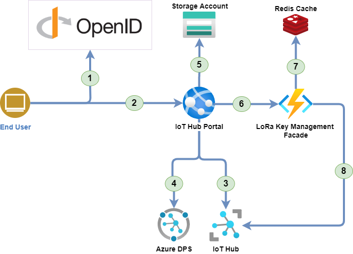

# User Guide

## Directory Structure

The code is organized into the following directory structure:

* **src**: Source code
    * **AzureIoTHub.Portal.Server.Tests**: Unit test project for thePortal
    * **AzureIoTHub.Portal**: The Portal project
        * **Client**: .NET 6 Blazor Web Assembly project that alow tovisualize the IoT Hub data
        * **Server**: .NET 6 Web API project that provides the API forthe Portal
        * **Shared**: Shared code between the Client and Server projects
* **templates**: contains the templates for the "deploy to Azure" button

## Overall Architecture

This schema represent the various components and how they interact to have a better understand of the various solution elements.

1. The user is authenticated by the OpenID Connect server.
1. The user access to the IoT Hub Portal with the OAuth2.0 token.
1. The IoT Hub portal uses the Azure IoT Hub REST API to retrieve the data.
1. The IoT Hub portal uses the Azure Device Provisioning Service to manage IoT Edge devices.
1. The IoT Hub portal uses the Azure Storage account to store the device models configuration (Images, Commands, etc.).
1. The IoT Hub portal uses the LoRa Key Management Facade to send the Cloud to Device messages for LoRa devices.
1. The LoRa Key Management Facade uses the Redis to store its cached data.
1. The LoRa Key Management Facade uses the Azure IoT Hub REST API to retrieve the LoRa device keys and send the C2D messages.

> Note: for more information about the LoRa Key Management Facade, see the [Azure IoT Edge LoRaWAN Starter Kit](https://azure.github.io/iotedge-lorawan-starterkit) page.

## IoT Hub Portal Configuration

By deploying the IoT Hub Portal, the user can configure the IoT Hub and the LoRaWAN network.

Since the IoT Hub Portal is deployed as a Docker container. The application settings are configurable in the environment variables.

### Application settings

Here are different settings that the user can configure:

* **OIDC__Authority**: The OpenID Connect issuer.
* **OIDC__MetadataUrl**: The OpenID Connect metadata URL (aka: well-known/openid-configuration).
* **OIDC__ClientId**: The OpenID Connect client ID for the Web UI.
* **OIDC__ApiClientId**: The OpenID Connect client ID for the API.
* **OIDC__Scope**: The OpenID Connect scope that represents the portal API.
* **IoTDPS__ServiceEndpoint**: The IoT Device Provisioning Service endpoint.
* **IoTDPS__DefaultEnrollmentGroup**: The default IoT Device Provisioning Service enrollment group.

### Connection strings

Here are different connection strings that the user can configure:

* **IoTHub__ConnectionString**: The connection string to the IoT Hub.
* **IoTDPS__ConnectionString**: The connection string to the Azure IoT Device Provisioning Service.
* **StorageAccount__ConnectionString**: The connection string to the Azure Storage account.

> Note: For a production relase, use might benefits from using the Azure Key Vault to store the connection strings.

## Device tags

The IoT Hub portal uses some tags to configure the devices. The tags are storeed in the Azure IoT Hub by its Device Twin.

* **deviceType**: The device type, can be "LoRa Device" or "null".
> By setting the device type to "LoRa Device", the device will be configured to send LoRaWAN and receive C2D commands.
* **modelId**: The device model ID that is used to retrieve the device model configuration.

## Storage Account

The Storage Account is used to store the device models configuration. You could benefits from using the same Storage Account that is used by the LoRa Key Management Facade.
This solution will use tables and blob storage to store its data. there is no need to create the tables and containers, the application will do it for you.

### Tables

The application uses the following tables:

* **DeviceTemplates**: The table that contains the device models configuration.
* **DeviceCommands**: The table that contains the device commands linked to the device models.

### Blob Storage

The application uses the following blob storage:

* **device-images**: The blob storage that contains the device images.

